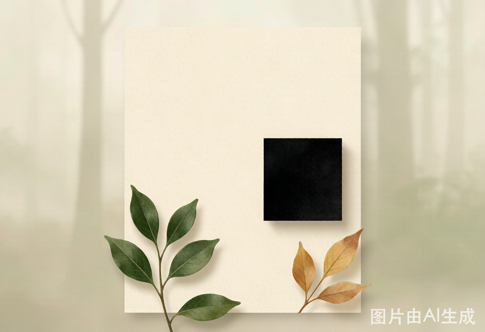
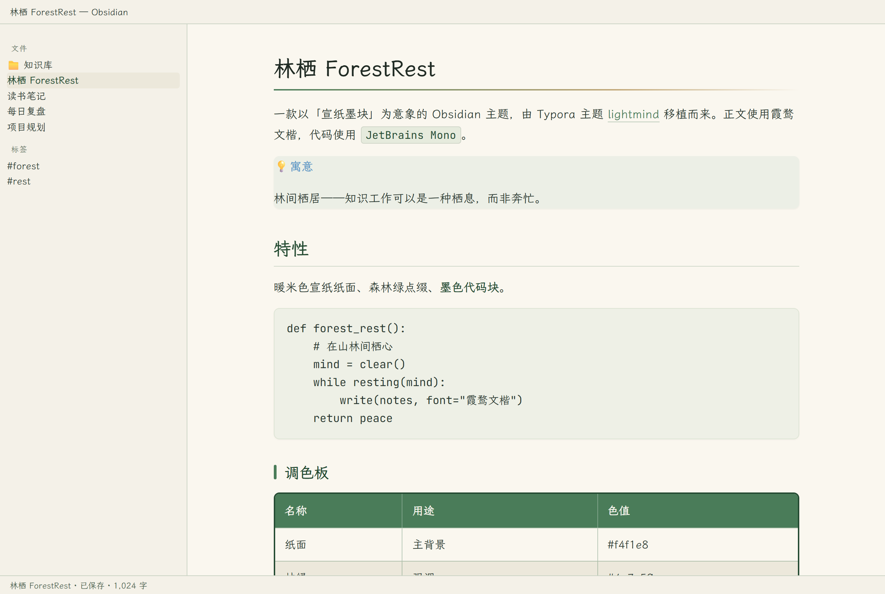
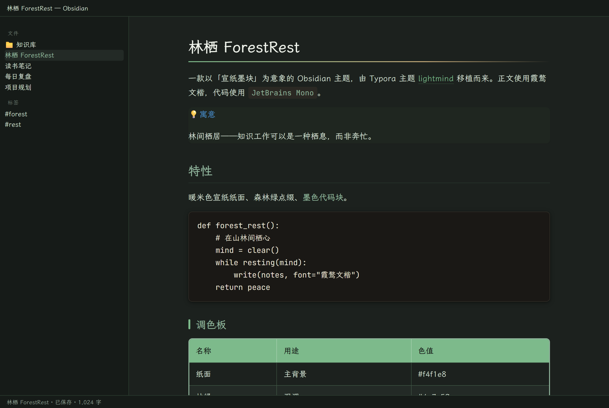

# 林栖 (ForestRest)

> **山林栖心** —— 一款以「宣纸墨块」为意象的 Obsidian 主题，由 Typora 主题 [lightmind](https://github.com/SunMoonTrain/LightMindTheme) 移植而来。

[](LICENSE)
[](manifest.json)
[](https://obsidian.md)
[](https://github.com/fengmz/ForestRest)
[](https://github.com/fengmz/ForestRest)

---

## 目录

- [寓意 · Design Philosophy](#寓意--design-philosophy)
- [特性 · Features](#特性--features)
- [调色板 · Palette](#调色板--palette)
- [预览 · Screenshots](#预览--screenshots)
- [安装 · Installation](#安装--installation)
- [自定义 · Customization](#自定义--customization)
- [兼容性与版本 · Compatibility](#兼容性与版本--compatibility)
- [目录结构 · Project Structure](#目录结构--project-structure)
- [致谢 · Acknowledgments](#致谢--acknowledgments)
- [许可证 · License](#许可证--license)

---

## 寓意 · Design Philosophy

**林栖**，取自「林间栖居」之意——古人退隐山林、栖心读书的生活理想。本主题试图把这种 *「在山林间安放身心」* 的体验，带入你的笔记与代码之中。它的深层寓意是：**知识工作可以是一种栖息，而非奔忙**——当思绪落于温暖的纸面、被森林的绿意轻轻环绕，心便自然沉静下来。

设计语言全部围绕「纸 · 林 · 墨」三元素展开：

| 意象 | 实现 | 寓意 |
| --- | --- | --- |
| **宣纸** | 暖米色纸面 `#f4f1e8` / `#faf7ef` | 传统书画之纸的温度，长时间阅读的低疲劳基底 |
| **森林** | 林绿 `#4a7c59`、深林 `#234a31`、新苔 `#8fb39b` | 枝叶从纸间透出的绿意，克制地点缀而非铺满 |
| **墨块** | 墨色代码块 `#232220` | 「宣纸上的墨块」——代码即落于纸上的浓墨 |
| **暖金/赭石** | `#c2a878` | 林间漏下的夕光与秋土，为冷绿注入暖意 |
| **山林色谱** | 苔紫 / 秋金 / 新生苔 / 赭石 / 溪青 / 暖陶 | 语法高亮的每种颜色都取自林中物，读码如行山 |
| **笔与墨** | 正文霞鹜文楷 · 代码 JetBrains Mono | 软笔书写的体温，对照硬朗精确的墨迹 |

浅色为主基调（纸的隐喻），深色则派生为「夜林」——`#161b18` 般的林 midnight 绿黑，让暗色模式依然栖于山林。

---

## 特性 · Features

- **暖米色宣纸纸面**，长时间阅读低疲劳。
- **森林绿点缀**，克制而自然，不喧宾夺主。
- **墨色代码块**——「宣纸上的墨块」核心视觉张力。
- **正文霞鹜文楷（LXGW WenKai），代码 JetBrains Mono** 的体温/精确对照。
- **山林色谱语法高亮**：苔紫、秋金、新生苔、赭石、溪青、暖陶。
- **浅色为主、深色为「夜林」兜底**，两套调色板同源派生。
- **完整主题化**：标注（Callouts）、表格、引用块、标签、数学公式、脚注、Mermaid 图表。
- **纯本地字体回退链**，不依赖任何外部网络资源。

---

## 调色板 · Palette

| 名称 | 用途 | 色值 | 预览 |
| --- | --- | --- | --- |
| 纸面 Page | 主背景 | `#f4f1e8` |  |
| 书写 Write | 编辑/阅读区 | `#faf7ef` |  |
| 林绿 Accent | 链接/强调 | `#4a7c59` |  |
| 深林 Deep | 标题/选中 | `#234a31` |  |
| 新苔 Soft | 次要绿 | `#8fb39b` |  |
| 暖金 Warm | 高亮/夕光 | `#c2a878` |  |
| 墨块 Ink | 代码底色 | `#232220` |  |
| 墨字 InkText | 代码文字 | `#e7e2d4` |  |
| 夜林 Night | 深色主背景 | `#161b18` |  |

---

## 预览 · Screenshots



> 上图为 **林栖 (ForestRest)** 的主题风格概念图：暖米色宣纸、墨色代码块（宣纸上的墨块）、森林绿枝叶与暖金秋叶，共同构成「纸 · 林 · 墨」的意象。

### 实际界面

| 浅色（宣纸） | 深色（夜林） |
| --- | --- |
|  |  |

- **浅色（宣纸）**：暖米色纸面 + 森林绿标题 + 墨色代码块。
- **深色（夜林）**：林 midnight 绿黑底 + 提亮的林绿强调。

---

## 安装 · Installation

### 方式一：社区主题浏览器（待上架）
1. 打开 Obsidian → **设置 → 外观 → 主题 → 管理**。
2. 搜索 **林栖 / ForestRest** 并启用。

### 方式二：手动安装
1. 下载本仓库的 `manifest.json` 与 `theme.css`。
2. 放入仓库目录：`<你的仓库>/.obsidian/themes/ForestRest/`。
3. 在 **设置 → 外观** 中选择 **ForestRest**。

### 方式三：通过 BRAT（开发版）
1. 安装 [BRAT](https://github.com/TfTHacker/obsidian42-brat) 插件。
2. `Add a beta theme` → 填入本仓库地址。
3. 在外观设置中启用 **ForestRest**。

---

## 自定义 · Customization

主题以 CSS 变量驱动，覆盖 `:root` 或 `.theme-light` / `.theme-dark` 中的变量即可微调。例如，将强调色改为更深的松绿：

```css
/* 在你的 snippet 或 theme.css 末尾追加 */
.theme-light {
  --accent: #2f6b43;
  --accent-deep: #173d24;
}
```

常用可调变量：

| 变量 | 含义 |
| --- | --- |
| `--bg-page` / `--bg-write` | 纸面 / 书写区背景 |
| `--accent` / `--accent-deep` | 林绿 / 深林强调色 |
| `--accent-warm` | 暖金点缀 |
| `--code-bg` / `--code-fg` | 墨块底色 / 墨字 |
| `--font-body` / `--font-mono` | 正文 / 代码字体栈 |
| `--cm-*` | 语法高亮山林色谱 |

---

## 兼容性与版本 · Compatibility

- **最低 Obsidian 版本**：`1.4.0`（见 `manifest.json` 的 `minAppVersion`）。
- **版本映射**：`versions.json` 将 Obsidian 应用版本映射到主题版本，供主题管理器回溯兼容。
- **模式**：同时支持 `light` 与 `dark`。

```json
// versions.json
{ "1.4.0": "1.0.0" }
```

---

## 目录结构 · Project Structure

```text
ForestRest/
├── manifest.json      # 主题元数据（名称/版本/作者/模式）
├── theme.css          # 主题样式（设计令牌 + 浅/深色映射）
├── versions.json      # Obsidian 版本 → 主题版本 映射
├── CHANGELOG.md       # 版本变更记录
├── LICENSE            # MIT License
├── README.md          # 本文件
└── images/            # 预览图（forestrest-preview.png 等）
```

---

## 发布 · Publishing

- 当前版本 **v1.0.0**，对应标签 `v1.0.0`，最低 Obsidian 版本 `1.4.0`。
- 提交至 Obsidian 社区主题：
  1. 在 GitHub 创建 Release（建议以 `v1.0.0` 作为 tag）。
  2. 向 [obsidian-releases](https://github.com/obsidianmd/obsidian-releases) 仓库提交 PR，指向本仓库。
  3. 仓库根目录须包含 `manifest.json` 与 `theme.css`（本仓库已满足）。

---

## 致谢 · Acknowledgments

- 移植自 Typora 主题 [lightmind](https://github.com/SunMoonTrain/LightMindTheme) 的设计理念（clear / light mind → 林栖）。
- 正文字体 **霞鹜文楷 (LXGW WenKai)** —— 开源人文中文字体。
- 代码字体 **JetBrains Mono** —— JetBrains 开源等宽字体。
- 主题的工程化、文档与预览图由 **WorkBuddy** 辅助完成。

---

## 许可证 · License

本项目基于 [MIT License](LICENSE) 开源。© 2026 fengmz.
