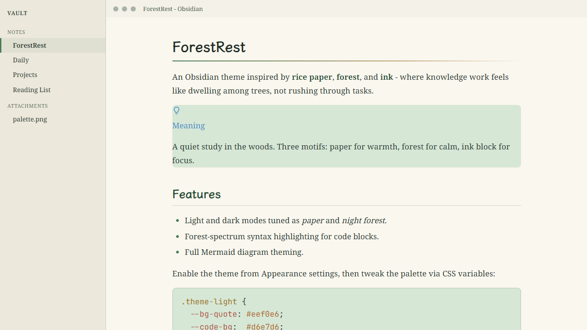

> 🌐 English ｜ [中文](README.zh.md)

# ForestRest

> **Dwelling in the woods** —— an Obsidian theme built around the imagery of "ink on rice paper", ported from the Typora theme [lightmind](https://github.com/SunMoonTrain/LightMindTheme).

[](LICENSE)
[](manifest.json)
[](https://obsidian.md)
[](https://github.com/fengmz/ForestRest)
[](https://github.com/fengmz/ForestRest)

---

## Table of Contents

- [Design Philosophy](#design-philosophy)
- [Features](#features)
- [Palette](#palette)
- [Screenshots](#screenshots)
- [Installation](#installation)
- [Customization](#customization)
- [Compatibility](#compatibility)
- [Project Structure](#project-structure)
- [Publishing](#publishing)
- [Acknowledgments](#acknowledgments)
- [License](#license)

---

## Design Philosophy

**ForestRest** takes its name from the ideal of retreating into the woods to rest the mind — the classical pursuit of scholars who withdrew to the mountains to read and think. The theme brings that experience of *"settling the mind among the hills and forests"* into your notes and code. Its deeper intent: **knowledge work can be a form of rest, not a relentless striving** — when thought lands on warm paper and is gently surrounded by the green of the forest, the mind naturally grows calm.

The whole design language revolves around three elements — **paper · forest · ink**:

| Element | Implementation | Meaning |
| --- | --- | --- |
| **Paper** | Warm beige surface `#f4f1e8` / `#faf7ef` | The warmth of traditional rice paper; a low-fatigue base for long reading |
| **Forest** | Forest green `#4a7c59`, deep green `#234a31`, new moss `#8fb39b` | Foliage peeking through the paper; green used sparingly as an accent |
| **Ink block** | Ink code background `#232220` | "A block of ink on rice paper" — code is thick ink brushed onto the page |
| **Warm gold / ochre** | `#c2a878` | Forest-filtered sunset light and autumn earth, warming the cool green |
| **Forest spectrum** | moss purple / autumn gold / new moss / ochre / stream cyan / warm clay | Every syntax color is drawn from something in the woods; reading code is like walking the forest |
| **Brush & ink** | Body in LXGW WenKai · code in JetBrains Mono | The warmth of a soft brush against the precision of hard ink |

Light is the primary mode (the paper metaphor); dark is derived as a "night forest" — a deep forest green-black (`#161b18`) that keeps the forest identity even after dark.

---

## Features

- **Warm beige rice-paper surface** for low-fatigue long reading.
- **Forest-green accents**, restrained and natural, never overwhelming.
- **Ink code blocks** — the core visual tension of "ink on rice paper" (宣纸上的墨块). In dark mode the block is ink-black (`#232220`); in light mode the same block uses a soft forest-green ground (`#d6e7d6`) so code stays gentle on the pale page.
- **Body in LXGW WenKai (霞鹜文楷), code in JetBrains Mono** — warmth versus precision.
- **Forest-spectrum syntax highlighting**: moss purple, autumn gold, new moss, ochre, stream cyan, warm clay.
- **Light-primary with a derived "night forest" dark mode**, both from one palette.
- **Full theming**: Callouts, tables, blockquotes, tags, math, and footnotes.
- **Pure local font fallback chain** — no external network dependencies.

---

## Palette

| Name | Usage | Hex | Preview |
| --- | --- | --- | --- |
| Page | Base background | `#f4f1e8` |  |
| Write | Editor / reading area | `#faf7ef` |  |
| Accent | Links / emphasis | `#4a7c59` |  |
| Deep | Headings / selection | `#234a31` |  |
| Soft | Secondary green | `#8fb39b` |  |
| Warm | Highlight / sunset | `#c2a878` |  |
| Ink | Code background | `#232220` |  |
| InkText | Code text | `#e7e2d4` |  |
| Night | Dark base background | `#161b18` |  |

---

## Screenshots



> The image above is a **concept preview** of ForestRest: warm beige paper, ink-black code blocks (ink on rice paper), forest-green foliage, and warm-gold autumn leaves — together expressing the "paper · forest · ink" motif.

### Actual interface

| Light (paper) | Dark (night forest) |
| --- | --- |
|  |  |

- **Light (paper)**: warm beige surface + forest-green headings + ink code blocks.
- **Dark (night forest)**: deep forest green-black ground + brightened forest-green accents.

---

## Installation

### Method 1: Community theme browser (pending submission)
1. Open Obsidian → **Settings → Appearance → Themes → Manage**.
2. Search for **ForestRest** and enable it.

### Method 2: Manual install
1. Download `manifest.json` and `theme.css` from this repository.
2. Place them in `<your vault>/.obsidian/themes/ForestRest/`.
3. Enable **ForestRest** under **Settings → Appearance**.

### Method 3: Via BRAT (development builds)
1. Install the [BRAT](https://github.com/TfTHacker/obsidian42-brat) plugin.
2. `Add a beta theme` → enter this repository URL.
3. Enable **ForestRest** under Appearance.

---

## Customization

The theme is driven by CSS variables. Override variables in `:root` or `.theme-light` / `.theme-dark` to fine-tune. For example, to shift the accent toward a deeper pine green:

```css
/* Append to your snippet or theme.css */
.theme-light {
  --accent: #2f6b43;
  --accent-deep: #173d24;
}
```

Commonly adjusted variables:

| Variable | Meaning |
| --- | --- |
| `--bg-page` / `--bg-write` | Paper / writing-area background |
| `--accent` / `--accent-deep` | Forest-green / deep-green accent |
| `--accent-warm` | Warm-gold accent |
| `--code-bg` / `--code-fg` | Ink-block background / text |
| `--font-body` / `--font-mono` | Body / code font stacks |
| `--cm-*` | Forest-spectrum syntax colors |

---

## Compatibility

- **Minimum Obsidian version**: `1.1.9` (see `minAppVersion` in `manifest.json`).
- **Version mapping**: `versions.json` maps Obsidian app versions to theme versions for backward-compatible updates.
- **Modes**: both `light` and `dark` are supported.

```json
{
  "1.0.0": "1.1.9"
}
```

---

## Project Structure

```text
ForestRest/
├── manifest.json      # Theme metadata (name / version / author / minAppVersion)
├── theme.css          # Theme styles (design tokens + light/dark mappings)
├── versions.json      # Obsidian version → theme version mapping
├── CHANGELOG.md       # Version history
├── LICENSE            # MIT License
├── README.md          # English documentation (GitHub default)
├── README.zh.md       # Chinese documentation
└── images/            # Store screenshot (preview-light-16x9.png)
```

---

## Publishing

- Current version **v1.0.0**, tagged `v1.0.0`, minimum Obsidian `1.1.9`.
- To submit to the Obsidian community themes:
  1. Create a GitHub Release (recommended tag: `v1.0.0`).
  2. Open a PR against the [obsidian-releases](https://github.com/obsidianmd/obsidian-releases) repository pointing to this repo.
  3. The repository root must contain `manifest.json` and `theme.css` (this repo already satisfies that).

---

## Acknowledgments

- Ported from the design philosophy of the Typora theme [lightmind](https://github.com/SunMoonTrain/LightMindTheme) (clear / light mind → dwelling in the woods).
- Body font **LXGW WenKai (霞鹜文楷)** —— an open-source humanist CJK typeface.
- Code font **JetBrains Mono** —— JetBrains' open-source monospace typeface.
- Engineering, documentation, and preview images assisted by **WorkBuddy**.

---

## License

Distributed under the [MIT License](LICENSE). © 2026 fengmz.
